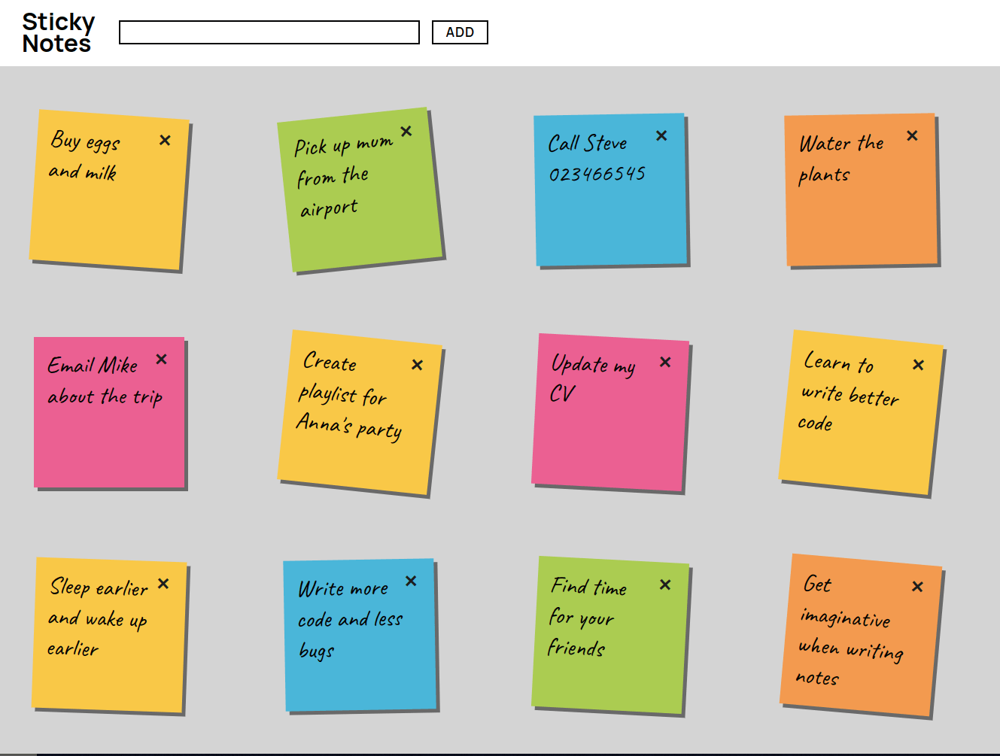

  

  <h1>Sticky Notes</h1>
  
  <h4>Fill your screen with sticky notes of various colors</h4>

  <h3><a href="https://sticky-notesjs.netlify.app/">Try me!</a></h3>

## Technologies Used

&nbsp;&nbsp;&nbsp;&nbsp;&nbsp;&nbsp;

&nbsp;&nbsp;&nbsp;&nbsp;&nbsp;&nbsp;

## Description

This is one of my very first projects (and it shows 😛) . Notes are stored in an array as objects.

## License

Copyright (c) 2023 Michael Kolesidis 
Licensed under the [GNU Affero General Public License v3.0](https://www.gnu.org/licenses/agpl-3.0.html).
